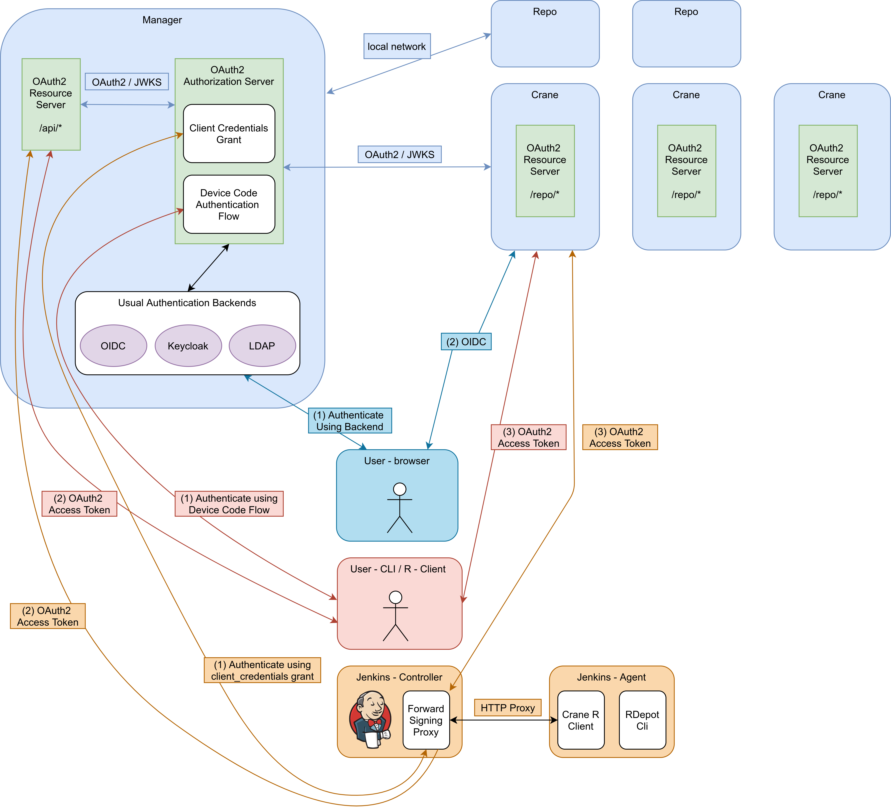
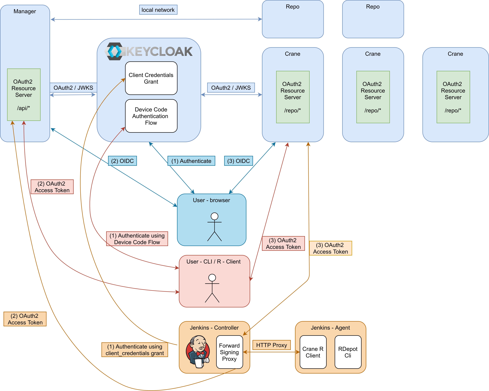

# Crane

## What is this?

Crane is a small Spring Boot project used for hosting authenticated R
Repositories. It is designed to be used in combination with RDepot.

## How does this work?

There are two different scenarios:

### 1) RDepot acting as OAuth2 Authorization Server

This deployment makes sense if you are using the complete RDepot ecosystem and
if you don't have a proper OAuth2/OIDC provider to use.



The deployment contains a few components:

- (one) RDepot Manager, containing the RDepot UI and an integrated OAuth2
  Authorization Manager
- (one or more) RDepot Repo servers
- (one ore more) Crane servers

The deployment can contain any amount of these type of users:

- regular user, accessing the deployment through their browser
  - the user first logs into the RDepot UI (using the integrated user database,
    ldap, keycloak or OIDC)
  - the user can seamlessly access the Crane Servers, because these are
    connected to the Authorization Server of the RDepot manager using OIDC
- regular user, accessing the deployment using the RDepot CLI or the Crane R
  client
  - the user first logs into their desired client, using the Device Code Flow
    (the Authorization of the client happens through the browser, so any
    authentication backend of RDepot Manager is supported)
  - the user now has an Access Token and Refresh Token
  - the user can access the Crane Servers using the Access Token
  - the user can access the RDepot API of the RDepot Manager using the Access
    Token
- CI user, accessing the deployment from a CI server (i.e., Jenkins in our
  use-cases)
  - somewhere on the Jenkins deployment a Forward Signing Proxy is running (e.g.,
    on a sidecar of the agents, as a separate service etc)
  - the Forward Signing Proxy logs into the Authorization Server of the RDepot
    Manager using its Client Credentials by using the `client_credentiasl`
    grant/flow.
  - this grant makes use of a special setup OAuth2 Client, consisting of a
    `client_id` and `client_secret`
  - the Forward Signing Proxy gets an Access Token (no refresh token) and
    attaches this to any request it proxies to the RDepot Manager or a Crane
    server
  - the Jenkins Agents can seamlessly access the RDepot Manager or Crane servers through the Forward Signing Proxy

### 2) External server acting as OAuth2 Authorization Server

This deployment makes sense if you are only using parts of the complete RDepot
ecosystem and/or if you already have a proper OAuth2/OIDC provider to use.



The deployment contains a few components:

- (one) OAuth2/OIDC Authorization Server (i.e., Keycloak in our use-cases)
- (one) RDepot Manager, containing the RDepot UI
- (one or more) RDepot Repo servers
- (one ore more) Crane servers

The deployment can contain any amount of these type of users:

- regular user, accessing the deployment through their browser
  - the user first logs into OAuth2 Authorization Server (possible because of a
    redirect by RDepot)
  - the user can seamlessly access the RDepot Manager and Crane Servers, because
    these are connected to the Authorization Server using OIDC
- regular user, accessing the deployment using the RDepot CLI or the Crane R
  client
  - the user first logs into their desired client, using the Device Code Flow on
    the OIDC Server (i.e., Keycloak)
  - the user now has an Access Token and Refresh Token
  - the user can access the Crane Servers using the Access Token
  - the user can access the RDepot API of the RDepot Manager using the Access
    Token
- CI user, accessing the deployment from a CI server (i.e., Jenkins in our use-cases)
  - somewhere on the Jenkins deployment a Forward Signing Proxy is running
    (e.g., on a sidecar of the agents, as a separate service etc)
  - the Forward Signing Proxy logs into the Authorization Server using its Client Credentials by using the `client_credentials` grant/flow.
  - this grant makes use of a special setup OAuth2 Client, consisting of a
    `client_id` and `client_secret`
  - the Forward Signing Proxy gets an Access Token (no refresh token) and
    attaches this to any request it proxies to the RDepot Manager or a Crane
    server
  - the Jenkins Agents can seamlessly access the RDepot Manager or Crane servers through the Forward Signing Proxy

As you can see both deployments are very similar. The only difference is whether
the integrated Authorization Server of RDepot is used.

## Usage

### 1) RDepot acting as OAuth2 Authorization Sever

1. install the modified Spring library:

    ```bash
    git clone https://github.com/LEDfan/spring-authorization-server -b device_code
    cd spring-authorization-server
    ./gradlew install
    ```

2. install RDepot

    ```bash
    git clone https://scm.openanalytics.eu/git/rdepot -v feature/25675
    # build RDepot
    ```

3. setup the configuration of RDepot

    ```application.yml
    repositories:
        - name: myrepo
          publication-uri: http://localhost/repo/myrepo
          server-address: http://localhost:9090/myrepo
    app:
      issuer: http://localhost:8080 # important!
      authentication: simple
      simple:
        users:
          - login: einstein
            password: testpassword
            name: Albert Einstein
          - login: tesla
            password: testpassword
            name: Nicolas Tesla
          - login: galieleo
            password: testpassword
            name: Galileo Galilei
          - login: newton
            password: testpassword
            name: Isaac Newton
          - login: newbie
            password: testpassword
            name: New User
          - login: doe
            password: testpassword
            name: John Doe
        default:
          admins:
            - einstein
    ```

4. start RDepot
5. create a Crane Docker image

    ```yaml
    server:
      port: 7070
    app:
      storage-location: /opt/rdepot/repo/
      openid-issuer-uri: http://localhost:8080

    spring:
      security:
        oauth2:
          client:
            registration:
              rdepot:
                client-authentication-method: none
                client-id: rdepot
                scope: openid
            provider:
              rdepot:
                issuer-uri: http://localhost:8080
    ```

    ```Dockerfile
    FROM
    ADD application.yml /opt/crane/application.yml
    ```

6. run crane

    ```bash
    docker run --net=host -v /opt/rdepot/repo:/opt/rdepot/repo crane-snapshot:latest
    ```

    **Note:** the `--net=host` is only needed so that the crane server can access
    the RDepot Manager (for OAuth2) in a proper deployment you want to do this using
    a Docker network or Kubernetes networking.

7. login into RDepot at <localhost:8080>
8. upload some packages to the myrepo and try to download them from the repo server, e.g. <127.0.0.1:7070/repo/myrepo/VERSION>

    **Note**: it is important to use `127.0.0.1` rather than `localhost` as the Spring Authorization server blocks requests with a redirect uri from `localhost`.

9. try the Device Code flow (see <https://projects.openanalytics.eu/issues/25675>)

### 2) External server acting as OAuth2 Authorization Server

1. installing the modified Spring library should not be necessary
2. setup Keycloak (or another OIDC server)
3. install RDepot

    ```bash
    git clone https://scm.openanalytics.eu/git/rdepot -v feature/25675
    # build RDepot
    ```

4. setup the configuration of RDepot

    ```application.yml
    repositories:
        - name: myrepo
          publication-uri: http://localhost/repo/myrepo
          server-address: http://localhost:9090/myrepo
    app:
      issuer: https://keycloak.ledfan.be/auth/realms/master # change this

      authentication: openid
      openid:
        # change these:
        auth-url: https://keycloak.ledfan.be/auth/realms/master/protocol/openid-connect/auth
        token-url: https://keycloak.ledfan.be/auth/realms/master/protocol/openid-connect/token
        jwks-url: https://keycloak.ledfan.be/auth/realms/master/protocol/openid-connect/certs
        baseUrl: http://localhost:8080
        client-id: rdepot
        client-secret:
        username-attribute: preferred_username
        default:
          admins:
            - jack

    ```

5. start RDepot
6. create a Crane Docker image

    ```yaml
    server:
      port: 7070
    app:
      storage-location: /opt/rdepot/repo/
      openid-issuer-uri: https://keycloak.ledfan.be/auth/realms/master

    spring:
      security:
        oauth2:
          client:
            registration:
              rdepot:
                client-secret:
                client-id: rdepot
                scope: openid
            provider:
              rdepot:
                issuer-uri: https://keycloak.ledfan.be/auth/realms/master
    ```

    ```Dockerfile
    FROM
    ADD application.yml /opt/crane/application.yml
    ```

7. run crane

    ```bash
    docker run -v /opt/rdepot/repo:/opt/rdepot/repo crane-snapshot:latest
    ```

8. login into RDepot at <localhost:8080>
9. upload some packages to the myrepo and try to download them form the repo server, e.g. <127.0.0.1:7070/repo/myrepo/VERSION>

    **Note**: it is important to use `127.0.0.1` rather than `localhost` as the Spring Authorization server blocks requests with a redirect uri from `localhost`.

10. try the Device Code flow using Keycloak

## Notes

You can easily get an OAuth2 Access Token from Keycloak using:

```bash
curl https://keycloak.ledfan.be/auth/realms/master/protocol/openid-connect/token \
  -H "Content-Type: application/x-www-form-urlencoded" \
  -d "grant_type=password" \
  -d "username=jack"  \
  -d "password=" \
  -d "client_id=rdepot" \
  -d "client_secret="
```

### Forward Signing Proxy

**Internal:**

```bash
docker run -it --net=host quay.io/gogatekeeper/gatekeeper:1.3.3 \
   --enable-forwarding=true \
   --forwarding-domains=localhost \
   --client-id=jenkins \
   --client-secret= \
   --discovery-url=http://localhost:8080/.well-known/openid-configuration\
   --forwarding-grant-type=client_credentials \
   --listen 127.0.0.1:3000
```

**External:**

(enable service accounts in the Keycloak client settings)

```bash
docker run -it --net=host quay.io/gogatekeeper/gatekeeper:1.3.3 \
   --enable-forwarding=true \
   --forwarding-domains=localhost \
   --client-id=jenkins_rdepot \
   --client-secret= \
   --discovery-url=https://keycloak.ledfan.be/auth/realms/master/.well-known/openid-configuration\
   --forwarding-grant-type=client_credentials \
   --listen 127.0.0.1:3000
```

**Test it**:

```bash
curl -v -k --proxy http://127.0.0.1:3000 http://localhost:7070/repo/abc
```
